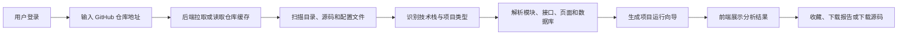
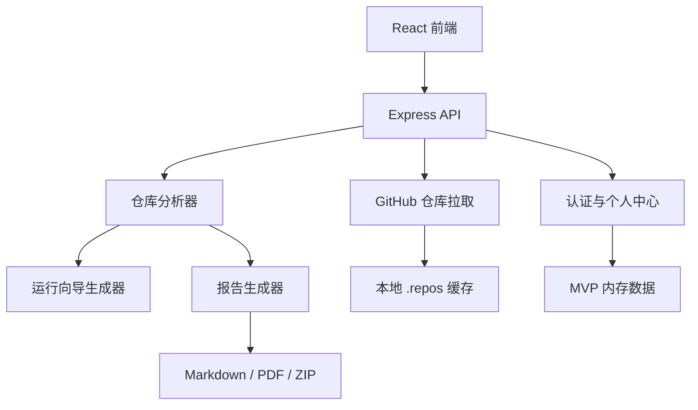

# 代码仓库智能导览器项目说明文档

## 1. 项目概述

### 1.1 项目名称

代码仓库智能导览器（Repo Guide）

### 1.2 项目定位

代码仓库智能导览器是一个面向开发者、学生和项目接手人员的 GitHub 仓库理解工具。

用户只需要输入一个 GitHub 仓库地址，系统就会自动拉取源码、扫描目录和配置文件，并将陌生代码整理成容易理解的项目导览，包括：

- 这个项目是做什么的
- 项目解决了什么实际问题
- 使用了哪些技术
- 主要代码位于哪些目录
- 核心模块之间如何分工
- 对外提供了哪些接口
- 包含哪些用户页面
- 数据库中有哪些表和关联关系
- 项目需要安装什么环境
- 前后端应该如何启动

项目不依赖大模型 API。当前分析结果由仓库文件扫描、配置文件解析和规则匹配生成，用户无需提供 AI Key。

### 1.3 项目价值

传统代码阅读通常需要开发者手动查看 README、目录、依赖文件、控制器、页面路由和数据库脚本。对于规模较大的项目，这个过程耗时且容易遗漏。

本项目将这些分散的信息集中到一个可视化页面中，主要解决以下问题：

1. 降低陌生项目的阅读门槛。
2. 帮助用户快速判断项目用途和技术栈。
3. 帮助开发者定位核心代码、接口和配置。
4. 根据真实仓库文件生成可执行的启动步骤。
5. 为课程作业、项目交接和代码审查提供结构化报告。

## 2. 目标用户

### 2.1 编程学习者

学习者可以将 GitHub 上的开源项目导入系统，快速了解项目结构、技术栈和运行方式，减少在大量目录中盲目查找的时间。

### 2.2 新接手项目的开发者

开发者可以通过概览、模块、接口、页面和数据库结构快速建立对项目的整体认识。

### 2.3 项目负责人

项目负责人可以下载 Markdown 或 PDF 分析报告，用于项目交接、内部说明和代码评审。

### 2.4 教师与学生

系统可以用于课程设计展示、毕业设计项目说明、代码结构检查和运行环境整理。

## 3. 核心业务流程



### 3.1 仓库输入

用户输入标准 GitHub 仓库地址，例如：

```text
https://github.com/owner/repository
```

系统会校验地址中的所有者和仓库名称，目前仅支持 `github.com` 仓库。

### 3.2 仓库拉取

系统优先使用浅克隆方式拉取仓库：

```bash
git clone --depth 1
```

如果 Git 连接失败，系统会尝试从 GitHub 下载默认分支 ZIP 压缩包作为回退方案。

拉取后的仓库缓存在本地 `.repos` 目录中，避免重复分析同一仓库时再次下载。

### 3.3 文件扫描

系统会统计仓库文件、目录数量和总体积，并读取有分析价值的源码与配置文件。

依赖目录、构建产物和版本控制目录不会参与主要分析，例如：

- `node_modules`
- `.git`
- `dist`
- `build`
- `target`
- `.idea`

### 3.4 规则分析

分析器根据文件名、依赖声明、源码结构和关键字识别项目特征，最后形成结构化分析结果。

## 4. 功能说明

### 4.1 用户认证

系统提供登录、注册、退出登录和会话检查功能。

登录页支持：

- 邮箱和密码输入
- 密码显示与隐藏
- 保持登录
- 注册新账号

当前 MVP 使用内存用户数据和 Cookie 会话。服务重启后，新注册用户和会话数据会丢失。

### 4.2 项目概览

项目概览重点回答普通用户最关心的问题：

- 项目定位
- 项目实际用途
- 代码重点目录
- 仓库文件数量
- 代码目录数量
- 实际分析文件数量
- 仓库总体积

“分析文件”表示系统已经读取文件内容，并将其用于技术栈、模块、接口、页面或数据库识别。

### 4.3 目录树

系统根据仓库真实目录生成可滚动的目录树，并对超出扫描限制的部分显示截断提示。

目录树主要用于：

- 观察项目层级
- 快速定位源码目录
- 查看配置文件位置
- 判断前后端是否分离

### 4.4 技术栈识别

系统通过依赖文件和关键配置识别技术栈，例如：

| 识别对象 | 主要依据 |
| --- | --- |
| Spring Boot | `pom.xml` 中包含 Spring Boot 依赖 |
| Maven | 存在 `pom.xml` |
| React | `package.json` 中包含 React |
| Vue | `package.json` 中包含 Vue |
| Node.js | 存在 `package.json` |
| Python | 存在 `requirements.txt`、`pyproject.toml` 等 |
| Docker | 存在 `Dockerfile` 或 Compose 文件 |
| MySQL | 数据源配置、SQL 文件或依赖声明 |
| Redis | Redis 配置或相关依赖 |

每项技术栈同时保留识别依据，方便后续追踪判断来源。

### 4.5 核心模块

系统根据一级目录、源码目录、配置目录和关键文件生成模块说明。

模块信息包括：

- 模块名称
- 模块路径
- 模块类型
- 模块用途
- 关键文件

### 4.6 接口与页面

后端接口分析会识别控制器中的路由声明，并尝试合并控制器公共路径与方法路径。

展示内容包括：

- 请求方法
- 完整路由
- 业务用途
- 所属业务分组
- 源码文件和行号

页面分析会识别：

- HTML 页面
- React 或 Vue 页面组件
- 前端路由入口
- 页面名称与访问路径

### 4.7 数据库结构

系统会扫描 SQL 文件、模型定义和迁移文件。

对于 SQL 建表语句，可以展示：

- 数据表名称
- 表的业务用途
- 字段名称
- 字段类型
- 是否允许为空
- 主键
- 外键
- 表之间的关联关系
- 定义文件和行号

### 4.8 项目运行向导

项目运行向导完全由规则生成，不调用 OpenAI、DeepSeek 或其他大模型服务。

向导包含：

- 项目类型
- 运行环境
- 数据库文件
- 配置文件
- 配置项摘要
- 后端启动步骤
- 前端启动步骤
- 注意事项

常见识别规则如下：

| 文件或配置 | 生成结果 |
| --- | --- |
| `pom.xml` | Maven 环境和 Maven 启动方式 |
| Spring Boot 依赖 | JDK、Maven 和 Spring Boot 启动步骤 |
| `package.json` | Node.js、npm 和脚本启动步骤 |
| `requirements.txt` | Python、pip 和依赖安装步骤 |
| `Dockerfile` | Docker 运行环境 |
| `.sql` 文件 | 数据库导入步骤 |
| `application.properties` | 服务端口和数据源配置 |
| `.env` | 前后端环境变量提示 |

### 4.9 个人中心

个人中心提供以下能力：

- 用户资料展示
- 用户名与头像修改
- 历史分析记录
- 收藏仓库
- 下载记录
- 报告详情预览
- 重新分析
- 删除历史记录

### 4.10 报告和源码下载

分析报告支持：

- Markdown 格式
- PDF 格式

报告内容包括项目简介、目录结构、技术栈、模块、接口与页面、数据库结构和运行指南。

用户还可以在“项目运行向导”标题栏右侧下载当前仓库的源码 ZIP。压缩包会排除 `.git` 历史目录和系统内部缓存标记。

## 5. 系统架构



### 5.1 前端

前端使用 React、TypeScript 和 Vite 构建。

主要页面包括：

- 登录与注册页
- 分析首页
- 仓库分析工作台
- 个人中心
- 报告详情页

工作台采用三栏布局：

- 左侧：仓库目录树
- 中间：概览、模块、接口/页面和数据库
- 右侧：项目运行向导

页面根据实际内容容器宽度进行响应式调整，而不只依赖整个浏览器宽度。

### 5.2 后端

后端使用 Express 和 TypeScript。

主要模块如下：

| 文件 | 职责 |
| --- | --- |
| `server/index.ts` | API 路由、认证中间件和静态资源服务 |
| `server/git.ts` | GitHub 地址解析、Git 拉取和 ZIP 回退 |
| `server/analyzer.ts` | 目录扫描和仓库结构分析 |
| `server/run-guide.ts` | 基于规则生成运行向导 |
| `server/profile.ts` | 用户资料、历史记录、收藏和报告生成 |
| `server/repository-archive.ts` | 仓库源码 ZIP 生成 |
| `server/types.ts` | 后端数据结构定义 |

## 6. API 说明

### 6.1 认证接口

| 方法 | 地址 | 说明 |
| --- | --- | --- |
| `POST` | `/api/auth/login` | 用户登录 |
| `POST` | `/api/auth/register` | 用户注册 |
| `GET` | `/api/auth/me` | 获取当前登录用户 |
| `POST` | `/api/auth/logout` | 退出登录 |

### 6.2 仓库分析接口

| 方法 | 地址 | 说明 |
| --- | --- | --- |
| `POST` | `/api/analyze` | 拉取并分析 GitHub 仓库 |
| `GET` | `/api/repos/:repoId` | 获取已有分析结果 |
| `GET` | `/api/repository/run-guide` | 获取项目运行向导 |
| `GET` | `/api/repositories/:repoId/archive` | 下载仓库源码 ZIP |

### 6.3 个人中心接口

| 方法 | 地址 | 说明 |
| --- | --- | --- |
| `GET` | `/api/profile` | 获取个人中心数据 |
| `PATCH` | `/api/profile` | 修改用户名或头像 |
| `GET` | `/api/profile/analysis-records/:recordId` | 查看报告详情 |
| `DELETE` | `/api/profile/analysis-records/:recordId` | 删除历史记录 |
| `POST` | `/api/profile/analysis-records/:recordId/favorite` | 收藏仓库 |
| `DELETE` | `/api/profile/analysis-records/:recordId/favorite` | 取消收藏 |
| `GET` | `/api/reports/:recordId/download` | 下载 Markdown 或 PDF 报告 |
| `GET` | `/api/profile/downloads/:downloadId/file` | 再次下载历史报告 |

## 7. 数据设计

当前 MVP 为了方便本地演示，用户、分析记录、收藏和下载记录保存在后端内存中。

项目已经在 `docs/database-schema.sql` 中提供正式数据库设计，包含：

### 7.1 用户表 `users`

保存用户邮箱、密码哈希、用户名、头像、角色、团队、注册时间和最近登录时间。

### 7.2 分析记录表 `repository_analysis_records`

保存仓库地址、项目类型、技术栈、分析状态、摘要、完整分析快照和运行向导快照。

### 7.3 收藏表 `repository_favorites`

保存用户与分析记录之间的收藏关系。

### 7.4 下载记录表 `report_download_records`

保存报告名称、仓库名称、下载格式和下载时间。

正式部署时建议使用 MySQL 8，并对密码使用 BCrypt 或 Argon2 哈希。

## 8. 本地开发与运行

### 8.1 环境要求

- Node.js 18 或更高版本
- npm
- Git
- 可访问 GitHub 的网络环境

### 8.2 安装依赖

```bash
npm install
```

### 8.3 开发模式

```bash
npm run dev
```

访问：

```text
http://127.0.0.1:4174/
```

### 8.4 类型检查

```bash
npm run typecheck
```

### 8.5 生产构建

```bash
npm run build
npm start
```

## 9. 项目目录

```text
repo-guide/
├─ docs/
│  ├─ database-schema.sql
│  └─ PROJECT_GUIDE.md
├─ public/
│  └─ repo-home-bg.png
├─ server/
│  ├─ analyzer.ts
│  ├─ git.ts
│  ├─ index.ts
│  ├─ profile.ts
│  ├─ repository-archive.ts
│  ├─ run-guide.ts
│  └─ types.ts
├─ src/
│  ├─ App.tsx
│  ├─ main.tsx
│  ├─ styles.css
│  └─ types.ts
├─ package.json
├─ tsconfig.json
└─ vite.config.ts
```

## 10. 安全与隐私

### 10.1 当前处理

- 会话 Cookie 使用 `httpOnly`。
- 仓库 ID 由仓库名称生成，不直接使用用户输入作为目录名。
- ZIP 解压时检查路径，防止目录穿越。
- 源码下载排除 `.git`。
- 头像文件限制类型和大小。
- GitHub 仓库 URL 会进行格式校验。

### 10.2 正式上线前需要加强

- 使用数据库持久化用户与分析记录。
- 使用密码哈希，禁止明文密码。
- 将会话存储迁移到 Redis 或数据库。
- 在 HTTPS 环境中启用 Cookie `secure`。
- 增加 CSRF 防护和接口限流。
- 限制单个仓库大小、文件数量和分析时间。
- 对私有仓库接入受控的 GitHub OAuth 授权。
- 增加定时任务清理仓库缓存和临时文件。

## 11. MVP 边界

当前版本重点验证“从 GitHub 地址生成可理解项目导览”的完整流程，因此存在以下边界：

- 只支持 GitHub 仓库。
- 用户数据和分析记录默认保存在内存中。
- 分析规则无法覆盖所有编程语言和框架。
- 超大型仓库会限制实际读取的文件数量。
- 复杂动态路由可能无法完整还原。
- ORM 动态模型和数据库迁移可能只能识别部分结构。
- 项目说明依赖 README 和源码规则，不使用生成式 AI。

## 12. 后续规划

### 第一阶段：持久化与部署

- 接入 MySQL。
- 接入 Redis 会话。
- 增加 Docker 部署文件。
- 增加缓存清理和任务状态管理。

### 第二阶段：分析能力增强

- 支持更多语言和框架。
- 增加模块关系图。
- 增加接口参数和响应结构分析。
- 增加数据库 ER 图。
- 增加代码搜索和文件预览。

### 第三阶段：团队协作

- 支持 GitHub OAuth。
- 支持私有仓库。
- 支持团队空间与报告分享。
- 支持分析结果版本对比。
- 支持仓库更新检测和增量分析。

## 13. 项目总结

代码仓库智能导览器不是简单的目录展示工具，而是将仓库拉取、源码扫描、技术识别、结构分析、运行说明和报告管理整合到一个平台中。

当前 MVP 已经具备从 GitHub 仓库地址到可视化分析结果的完整闭环。它能够帮助用户更快理解陌生项目，也为后续扩展代码搜索、关系图、团队协作和智能分析提供了清晰基础。

